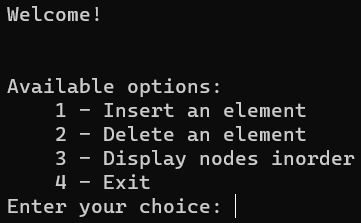

# About repository
<p align="justify">
This repository contains the implementation of the Red-Black Tree data structure, developed as part of the Advanced Algorithms and Data Structures college course at the <a href="https://www.etf.unsa.ba/">Faculty of Electrical Engineering Sarajevo</a>. The solution is implemented in .NET 7.
</p>


# Project structure
    .
    ├── RedBlackTree                          # Console app
    ├── RedBlackTree.Tests                    # xUnit tests
    ├── RedBlackTree.sln                      # Solution file
    └── README.md


# Demonstration
<p align="justify">
The image below illustrates the available options in the console app.
</p>
<div align="center">
  
</div>
<p>
The result can be visualized using this <a href="https://www.cs.usfca.edu/~galles/visualization/RedBlack.html">simulator</a>. 
</p>


# Getting Started
<p align="justify">
Follow the instructions below to get local copy up and running.
</p>

## Prerequisites
1. <a href="https://dotnet.microsoft.com/en-us/download/dotnet/7.0">.NET 7 SDK</a>

## Installation
1. Clone the repository
```bash
git clone https://github.com/mkokor/red-black-tree.git
```

## Execution
<p align="justify">
Run command below to start the console app (<i>RedBlackTree</i> folder).
</p>

```bash
dotnet run
```

<p align="justify">
Run command below to execute unit tests (<i>RedBlackTree.Tests</i> folder).
</p>

```bash
dotnet test
```
